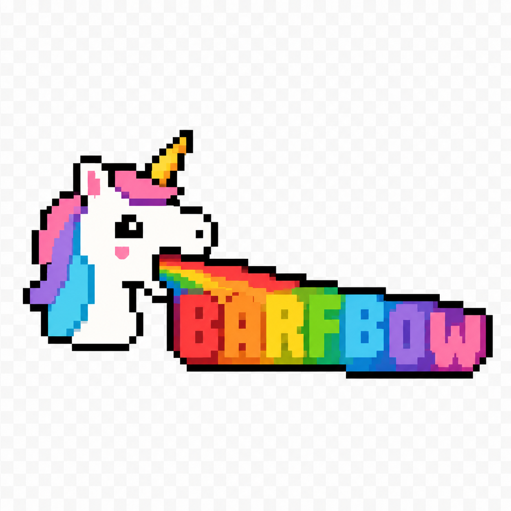
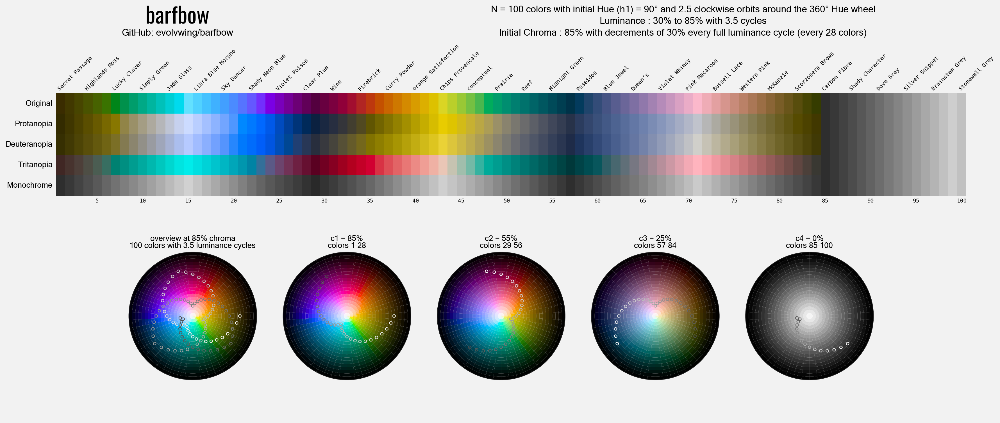
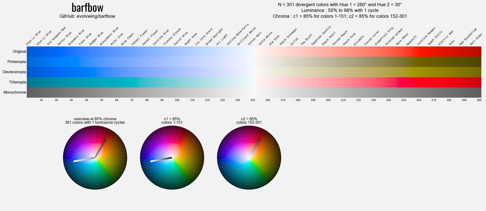
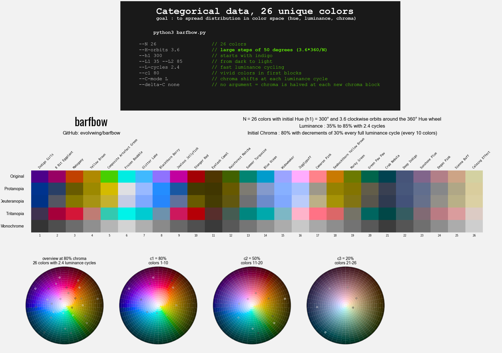
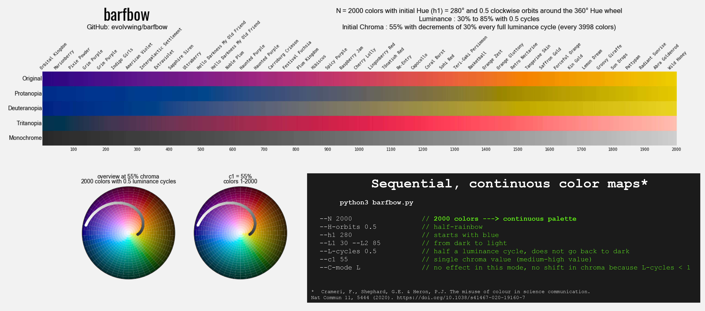

# barfbow

<p align="center">
  
</p>

`barfbow` generates OKLCh color palettes and previews them as a PNG with color-vision simulations, monochrome rendering, named swatches, and OKLCh walk wheels.

Choose the number of colors (`N`), then set how many times the palette should orbit the Hue wheel (`H-orbits`; positive values move clockwise). Colors cycle between two luminance levels (`L1` and `L2`) to add step-to-step contrast. Chroma can also shift in blocks, letting the palette move from vivid to muted colors, or the reverse.



## Install

Clone the repository, create a virtual environment, and install the dependencies:

```bash
git clone https://github.com/evolvwing/barfbow.git
cd barfbow
python3 -m venv .venv
source .venv/bin/activate
python -m pip install --upgrade pip
python -m pip install -r requirements.txt
```

You can also install the local command in editable mode:

```bash
python -m pip install -e .
```

After that, run either `python barfbow.py ...` from the repository or the installed `barfbow ...` command.

## Interactive Shiny app

Launch the local app, then open the displayed address in Chrome:

```bash
python3 -m shiny run --reload app.py
```

The app provides live controls for every palette parameter, browser-native
swatches and OKLCh walk wheels, color-vision simulations, nearby color names,
the full palette table, CSV/PNG downloads, a sourceable R palette with ggplot2
scale helpers, and shareable parameter links. Each palette gets a deterministic,
Romance-inspired name used in the preview, shared URL, PNG, R object, and download
filenames. Numeric CLI parameters are
sliders; `C-mode`, halving, and divergent behavior use compact mode controls.
The preset menu loads the default, categorical, sequential, and divergent
examples documented below, with the sequential example adapted to the app's
1,000-color limit; every value remains editable afterward.
The downloaded PNG is rendered by the same Matplotlib code as the CLI.

## Quick Start

Run with the default command:

```bash
python barfbow.py
```

Save a PNG preview:

```bash
python barfbow.py --save-png --png-path palette.png
```

Save both CSV and PNG:

```bash
python barfbow.py --save-csv --csv-path palette.csv --save-png --png-path palette.png
```

The current no-argument default is:

```bash
python3 barfbow.py --N 100 --H-orbits 2.5 --h1 90 --L1 30 --L2 85 --L-cycles 3.5 --c1 85 --deltaC -30 --C-mode L
```

## Parameters

- `--N`: number of colors.
- `--H-orbits`: number of Hue orbits around the 360 degree Hue wheel. Negative values reverse direction.
- `--h1`: initial Hue angle in degrees.
- `--h2`: second Hue angle for divergent palettes. Defaults to `h1 + 180`.
- `--L1` / `--L2`: OKLCh luminance endpoints, as percentages. Normal palettes clamp these to `0..100`; divergent palettes allow out-of-range values for steeper ramps.
- `--L-cycles`: number of luminance cycles from `L1` to `L2` and back.
- `--c1`: initial barfbow chroma percentage, clamped to `0..100`.
- `--deltaC`: chroma change between blocks. Use a number such as `-30`, or use `none` to halve each new block. In divergent mode, it defaults to `0` if omitted.
- `--C-mode`: chroma progression mode.
- `--divergent`: use a two-sided palette with fixed Hue blocks instead of Hue stepping.
- `--save-csv` / `--csv-path`: write the generated table.
- `--save-png` / `--png-path`: save the PNG preview.

## Chroma Scale

barfbow chroma is a friendly `0..100` design scale. Internally, it maps to OKLCh chroma like this:

```text
OKLCh C = barfbow C% * 0.0032
```

So `--c1 100` requests OKLCh `C = 0.32`, which is 80% of an OKLCh `C = 0.4` reference scale. A few examples:

```text
barfbow C 100 -> OKLCh C 0.320 -> 80% of 0.4
barfbow C 85  -> OKLCh C 0.272 -> 68% of 0.4
barfbow C 50  -> OKLCh C 0.160 -> 40% of 0.4
```

Some OKLCh colors are outside what regular sRGB screens can display. When that happens, barfbow keeps the requested `L` and Hue, then reduces the rendered chroma just enough to fit inside sRGB. The terminal and CSV `C%` column still show the requested barfbow chroma value.

## C-mode

`--C-mode` controls when chroma advances from one block to the next:

- `--C-mode L`: shift chroma after each full luminance cycle.
- `--C-mode H`: shift chroma after each full Hue orbit.
- `--C-mode k`: shift chroma every `k` colors, for example `--C-mode 12`. Non-integers are rounded down, negative values are made positive, and values below `1` become `1`.

Chroma values are generated as:

```text
c1, c1 + deltaC, c1 + 2 * deltaC, ...
```

and clamped to the `0..100` range. With `--deltaC none`, they become:

```text
c1, c1 / 2, c1 / 4, ...
```

## Divergent Mode

Use `--divergent` when you want a palette that separates into two opposing color families instead of walking continuously around the Hue wheel. This is useful for two-sided scales, contrasts, before/after groups, negative/positive values, or any palette where the middle should be the brightest point and each side should fade back toward a darker endpoint.

`--divergent` builds a two-sided palette. It keeps `L-cycles` fixed at `1`, uses `h1` for colors `1..ceil(N/2)`, then uses `h2` for the remaining colors. If `--h2` is not provided, it defaults to the opposite Hue: `h1 + 180`.

In divergent mode only, `L1` and `L2` are not clamped to `0..100`. Out-of-range luminance values can be used to make the ramp steeper; final RGB still clips to displayable sRGB.

Odd values of `N` produce a symmetric divergent palette because there is one shared center color at `L2`. For example, use `--N 201` instead of `--N 200` when you want 100 colors on each side plus one central peak color.

The first block uses chroma `c1`; the second block uses `c1 + deltaC`, clamped to `0..100`. If `--deltaC` is omitted in divergent mode, it defaults to `0`, so both sides use the same chroma.

```bash
python barfbow.py --divergent --N 16 --h1 340 --L1 50 --L2 80 --c1 85 --deltaC -30 --save-png
```

## Output

The PNG preview includes:

- original color swatches;
- protanopia, deuteranopia, and tritanopia simulations;
- a monochrome row;
- nearby color names from `color_names_meodai.csv`;
- sequence labels;
- OKLCh wheel views showing the full walk and each chroma block.

The color-name dataset is bundled locally in `color_names_meodai.csv` and is derived from the open `meodai/color-names` project.

## Examples

### Divergent blue-red ramp

This example uses divergent mode to make a two-sided palette with 301 colors. The first half moves from blue to pale blue using `h1=260`; the second half moves from pale red back to red using `h2=30`. Because `N=301` is odd, the brightest point at `L2=98` appears once as a shared center color.

```bash
python barfbow.py --divergent --N 301 --h1 260 --h2 30 --L1 50 --L2 98 --save-png
```

<p align="center">
  
</p>

### Categorical data

<p align="center">
  
</p>

### Sequential/continuous palette

<p align="center">
  
</p>

## License

MIT. See `LICENSE`.

<p align="center">
  
</p>
